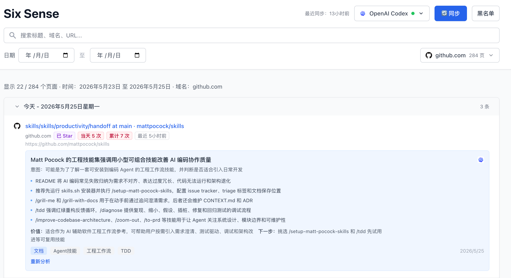

# Six Sense Web

Six Sense Web 是一个本地优先的浏览器历史管理与 AI 分析工具。它会同步本机 Chrome 浏览记录和书签，按日期、域名、访问频次组织页面，并调用本地 AI 编码 Agent 对网页内容生成结构化洞察。

> 数据默认保存在本机，AI 分析通过本地 CLI 进程完成，不依赖远程账号同步服务。

## 界面预览



## 功能特性

- 同步最近一段时间的 Chrome 浏览历史，并按天聚合展示
- 支持标题、域名、URL 关键词搜索
- 支持日期范围过滤和域名筛选
- 自动识别本地可用的 AI Agent，目前支持 Claude Code 和 OpenAI Codex
- 对单个网页发起流式 AI 分析，生成摘要、意图、要点、价值和下一步建议
- 识别 Chrome 书签和 GitHub Star 状态，帮助区分重要页面
- 支持 URL、域名等规则加入黑名单，隐藏低价值历史记录
- 所有核心数据存储在本地 SQLite 数据库中

## 技术栈

- 前端：React 18、TypeScript、Vite、TailwindCSS
- 后端：Go、net/http、SQLite
- 数据源：Chrome History、Chrome Bookmarks
- AI 集成：本地 CLI 进程调用 Claude Code / OpenAI Codex

## 项目结构

```text
.
├── backend-go/        # Go 后端实现
├── frontend/          # React + Vite 前端
├── docs/              # 项目文档与图片资源
├── package.json       # 根目录开发脚本
└── CLAUDE.md          # 项目协作规范
```

## 环境要求

- Node.js 18+
- npm
- Go 1.24+
- macOS + Google Chrome
- 可选：Claude Code CLI 或 OpenAI Codex CLI

默认 Chrome 历史路径为：

```text
~/Library/Application Support/Google/Chrome/Default/History
```

如果你使用的是其他 Chrome Profile，可以通过 `CHROME_HISTORY_PATH` 指定。

## 快速开始

安装依赖：

```bash
npm install
npm run install:all
```

启动后端：

```bash
cd backend-go
GOCACHE=/private/tmp/go-build go run ./cmd/server
```

启动前端：

```bash
cd frontend
npm run dev
```

打开：

```text
http://localhost:5173
```

后端默认监听：

```text
http://127.0.0.1:8000
```

健康检查：

```bash
curl http://127.0.0.1:8000/health
```

## AI Agent 配置

Six Sense Web 会自动从 `PATH` 和常见安装目录中查找可用 Agent。也可以显式指定 CLI 路径：

```bash
CLAUDE_PATH=/path/to/claude go run ./cmd/server
CODEX_PATH=/path/to/codex go run ./cmd/server
```

当前支持：

- `claude`：Claude Code
- `codex`：OpenAI Codex

如果未检测到可用 Agent，历史同步和浏览仍可使用，只是无法发起 AI 分析。

## 常用环境变量

| 变量 | 默认值 | 说明 |
| --- | --- | --- |
| `HOST` | `127.0.0.1` | 后端监听地址 |
| `PORT` | `8000` | 后端监听端口 |
| `DATA_DIR` | `~/.six-sense` | 本地数据目录 |
| `DB_PATH` | `~/.six-sense/web.db` | SQLite 数据库路径 |
| `CHROME_HISTORY_PATH` | Chrome Default Profile History | Chrome 历史数据库路径 |
| `CORS_ORIGINS` | `http://localhost:5173,http://127.0.0.1:5173` | 允许访问后端的前端源 |
| `CLAUDE_PATH` | 自动检测 | Claude Code CLI 路径 |
| `CODEX_PATH` | 自动检测 | OpenAI Codex CLI 路径 |

## 开发脚本

根目录：

```bash
npm run install:all
npm run dev
```

前端：

```bash
cd frontend
npm run dev
npm run build
npm run preview
```

后端：

```bash
cd backend-go
go test ./...
go run ./cmd/server
```

## 数据与隐私

- 浏览历史会从本机 Chrome History 数据库复制后读取，避免直接锁定浏览器数据库
- 应用数据默认写入 `~/.six-sense/web.db`
- 页面分析由本地 Agent CLI 执行，网页内容会作为提示词输入本地 CLI
- 不建议把数据库、日志、`.env` 或个人浏览截图提交到公开仓库

## 故障排查

### 端口 8000 被占用

先检查占用进程：

```bash
lsof -iTCP:8000 -sTCP:LISTEN -n -P
```

如果确认是旧开发进程，可以结束后重启：

```bash
lsof -tiTCP:8000 -sTCP:LISTEN | xargs kill -9
```

### 同步失败

- 确认 Chrome 已安装并产生过浏览历史
- 确认 `CHROME_HISTORY_PATH` 指向真实存在的 `History` 文件
- 如果 Chrome 使用多 Profile，检查 `Profile 1`、`Profile 2` 等目录
- 确认后端进程可以读写 `DATA_DIR`

### AI 分析不可用

- 确认已安装 Claude Code CLI 或 OpenAI Codex CLI
- 在终端运行 `claude --version` 或 `codex --version`
- 如果命令不在 `PATH`，使用 `CLAUDE_PATH` 或 `CODEX_PATH` 指定完整路径

## License

暂未指定许可证。公开发布前建议补充 `LICENSE` 文件。
